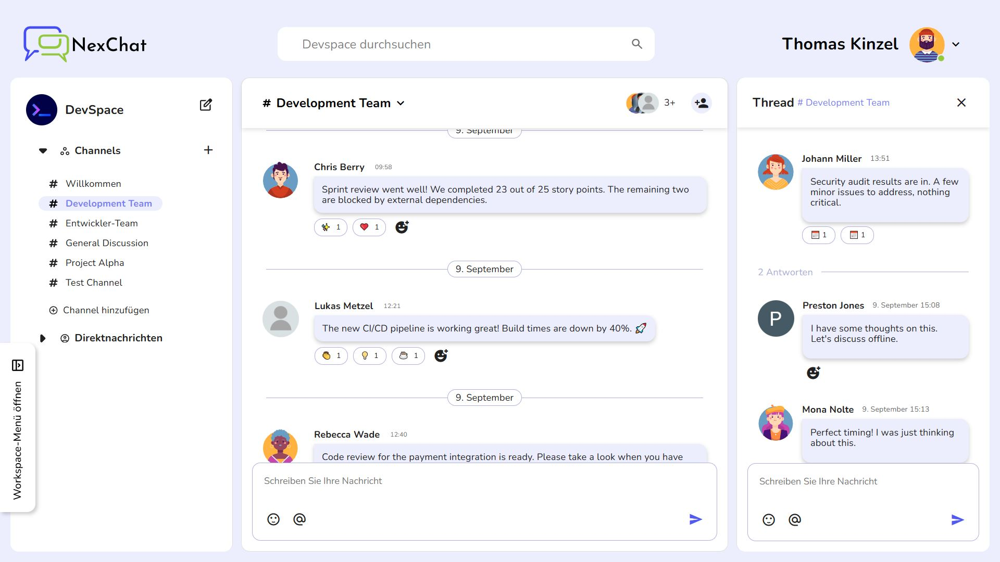

# � NexChat

A modern, real-time chat application inspired by Slack, built with Angular 17 and Firebase. NexChat provides seamless team communication with channels, direct messages, threads, and rich features for professional collaboration.

🌐 **[View Live Demo](https://your-nexchat-demo.web.app/)**


---




---

## ✨ Features

### 🔐 Authentication & User Management
- **📧 Email Authentication**: Secure registration and login with Firebase Auth
- **🔑 Password Reset**: Email-based password recovery system
- **👤 Profile Management**: Edit name, avatar, and user preferences
- **🌐 Guest Access**: Try the app without registration
- **🔄 Session Management**: Automatic logout after 15 minutes of inactivity
- **✅ Form Validation**: Real-time validation with custom error messages

### 💬 Real-Time Communication
- **📱 Direct Messages**: Private conversations between team members
- **🏢 Channel System**: Public and private channels for organized discussions
- **🧵 Thread Discussions**: Focused conversations within message threads
- **😀 Emoji Reactions**: Express reactions with a rich emoji picker
- **📝 Rich Text Support**: Insert emojis directly into messages
- **🔍 Smart Search**: Full-text search across messages, channels, and users
- **📌 Mentions**: Tag users with `@username` and channels with `#channelname`

### 🏗️ Channel Management
- **➕ Create Channels**: Set up new channels with descriptions
- **👥 Member Management**: Add/remove members from channels
- **✏️ Channel Editing**: Modify channel names and descriptions
- **🚪 Leave Channels**: Easy channel departure functionality
- **🔒 Privacy Controls**: Public and private channel options

### 🎨 User Experience
- **📱 Fully Responsive**: Optimized for desktop, tablet, and mobile
- **🌙 Modern UI**: Clean Material Design interface
- **⚡ Real-Time Updates**: Instant message delivery and updates
- **🎯 Intuitive Navigation**: Easy-to-use workspace sidebar
- **🔔 Online Status**: See who's currently active
- **📊 Message Threading**: Organized conversation flows

## 🛠️ Tech Stack

### Frontend
- **Framework**: Angular 17.0.0 with Standalone Components
- **Language**: TypeScript 5.2.2 (Strict Mode)
- **Styling**: SCSS with Angular Material 17.0.0
- **State Management**: RxJS Observables & Angular Signals
- **Forms**: Angular Reactive Forms with Validation

### Backend & Services
- **Authentication**: Firebase Auth 10.0.0
- **Database**: Firestore (NoSQL Real-time Database)
- **File Storage**: Firebase Storage
- **Hosting**: Firebase Hosting
- **Real-time**: Firestore Real-time Listeners

### Libraries & Tools
- **UI Components**: Angular Material & Angular CDK
- **Emoji Support**: @ctrl/ngx-emoji-mart
- **UUID Generation**: uuid library
- **Date Handling**: Native JavaScript Date API
- **Build Tool**: Angular CLI 17.0.0
- **Testing**: Jasmine & Karma

### Architecture & Patterns
- **Design Pattern**: Service-Component Architecture
- **Data Flow**: Reactive Programming with RxJS
- **Connection Management**: Custom Firestore Connection Manager
- **Error Handling**: Comprehensive error boundaries
- **Code Quality**: TypeScript strict mode, Clean Code principles

## 🎯 Core Components

### 1. Authentication System
- Sign-in/Sign-up flows
- Password reset functionality
- Guest user support
- Session management
- Profile customization

### 2. Workspace Dashboard
- Channel navigation sidebar
- Direct message list
- User status indicators
- Search functionality
- Responsive mobile drawer

### 3. Chat Interface
- Real-time message display
- Message composition with emoji picker
- File upload support
- Message editing and reactions
- Thread view integration

### 4. Channel Management
- Channel creation wizard
- Member invitation system
- Channel settings panel
- Privacy controls
- Admin functions

### 5. User Profile System
- Avatar selection and upload
- Profile information editing
- Online status management
- User search and discovery

## 🚀 Getting Started

### Prerequisites
- Node.js (v18 or higher)
- npm or yarn package manager
- Angular CLI
- Firebase project setup

### Installation

1. **Clone the repository**
   ```bash
   git clone https://github.com/preston-jones/ChatApp.git
   cd ChatApp
   ```

2. **Install dependencies**
   ```bash
   npm install
   ```

3. **Firebase Configuration**
   - Create a Firebase project at [Firebase Console](https://console.firebase.google.com/)
   - Enable Authentication, Firestore, and Storage
   - Copy your Firebase config to `src/environments/`

4. **Environment Setup**
   ```bash
   # Copy environment template
   cp src/environments/environment.example.ts src/environments/environment.ts
   # Add your Firebase configuration
   ```

5. **Start development server**
   ```bash
   npm start
   # or
   ng serve
   ```

6. **Open in browser**
   Navigate to `http://localhost:4200/`

### Build for Production

```bash
# Build the project
npm run build

# Deploy to Firebase
firebase deploy
```

## 🏗️ Project Structure

```
src/
├── app/
│   ├── board/                    # Main chat interface
│   │   ├── chat-window/         # Message components
│   │   ├── thread/              # Thread discussions
│   │   └── workspace/           # Navigation sidebar
│   ├── dialogs/                 # Modal dialogs
│   │   ├── profile-dialog/      # User profile management
│   │   ├── channel-description/ # Channel settings
│   │   └── members-dialog/      # Member management
│   ├── login/                   # Authentication components
│   │   ├── sign-in/            # Login interface
│   │   ├── create-account/     # Registration flow
│   │   └── reset-password/     # Password recovery
│   └── shared/                  # Shared services & models
│       ├── models/             # Data models
│       ├── services/           # Business logic
│       └── styles/             # Global styles
├── assets/                      # Static resources
│   ├── images/                 # App images & avatars
│   └── fonts/                  # Custom fonts
└── environments/               # Environment configurations
```

## 📱 Responsive Design

NexChat is fully responsive with optimized layouts for:
- **Desktop**: 1920px and above (Full workspace layout)
- **Large Tablets**: 1024px - 1919px (Adaptive sidebar)
- **Tablets**: 768px - 1023px (Collapsible navigation)
- **Mobile Large**: 480px - 767px (Mobile-first approach)
- **Mobile**: 479px and below (Touch-optimized interface)

## 🔧 Key Services

### FirestoreConnectionManager
Centralized management of real-time Firestore listeners to prevent connection overload and optimize performance.

### AuthService
Comprehensive authentication handling with Firebase Auth integration, session management, and user state tracking.

### ChannelsService
Channel management, member operations, and real-time channel updates with connection pooling.

### MessagesService
Real-time message handling, thread management, and message operations with optimized listeners.

### DirectMessagesService
Private messaging system with conversation management and real-time updates.

## 🧪 Testing

```bash
# Run unit tests
npm test

# Run tests with coverage
ng test --code-coverage

# Run end-to-end tests
npm run e2e
```

## 📋 Available Scripts

- `npm start` - Start development server
- `npm run build` - Build for production
- `npm test` - Run unit tests
- `npm run lint` - Run ESLint
- `npm run e2e` - Run end-to-end tests
- `firebase deploy` - Deploy to Firebase

## 🔧 Configuration

### Angular Budget Configuration
- **Development**: 5MB warning, 10MB error
- **Production**: 2MB warning, 5MB error
- **Component Styles**: 10KB warning, 15KB error

### Firebase Security Rules
The app uses custom Firestore security rules to ensure data privacy and proper access control.

### TypeScript Configuration
- Strict mode enabled
- ES2022 target
- Optimized for Angular 17+

## 🎨 Design System

### Color Palette
- **Primary**: Material Indigo
- **Accent**: Custom blue tones
- **Background**: Clean whites and grays
- **Text**: High contrast for accessibility

### Typography
- **Primary Font**: Nunito (Google Fonts)
- **Secondary Font**: Figtree
- **Icon Font**: Material Icons

## 🔒 Security Features

- **Authentication**: Firebase Auth with email verification
- **Data Validation**: Client and server-side validation
- **Access Control**: Firestore security rules
- **Session Management**: Automatic timeout and cleanup
- **XSS Protection**: Angular's built-in sanitization

## 📈 Performance Optimizations

- **Lazy Loading**: Route-based code splitting
- **OnPush Strategy**: Optimized change detection
- **Connection Pooling**: Efficient Firestore listener management
- **Bundle Analysis**: Optimized bundle sizes
- **Image Optimization**: Compressed assets and WebP support

## 🤝 Contributing

1. Fork the repository
2. Create a feature branch (`git checkout -b feature/AmazingFeature`)
3. Commit your changes (`git commit -m 'Add some AmazingFeature'`)
4. Push to the branch (`git push origin feature/AmazingFeature`)
5. Open a Pull Request

### Development Guidelines
- Follow Angular Style Guide
- Write unit tests for new features
- Use TypeScript strict mode
- Follow Clean Code principles
- Document complex functions

---

*Built with ❤️ using Angular 17, Firebase, and modern web technologies.*
