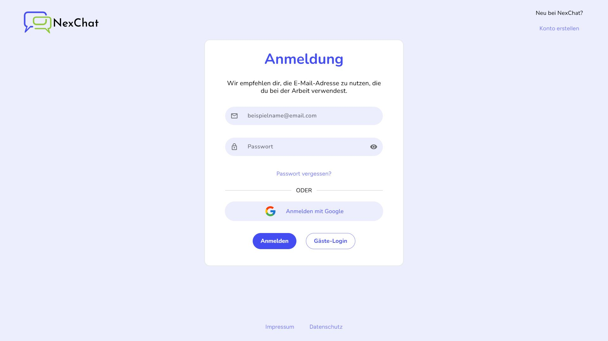

# 📌 NexChat – A Modern Slack Clone

**NexChat** is a chat application with real-time communication, inspired by Slack.  
The app provides a real-time communication platform with channels, direct messages, threads, emoji reactions, mentions, and more for clear and structured team collaboration.

---

---

## 🚀 Features

### 🔐 User Accounts & Administration
- Registration with email & password  
- Validated forms with specific error messages  
- Login & logout  
- Password reset via email  
- Profile editing (name & avatar)  
- Expandable/collapsible menu for channels & direct messages  
- *Optional:* Real-time online status  

### 💬 Communication
- Direct messages between members  
- Public & private channels  
- Threads for focused discussions  
- Emoji reactions to messages  
- Insert emojis into messages  
- Mentions via `@User` and `#Channel`  
- Full-text search for messages  

### 📂 Channel Management
- Create channels with name & description  
- Add members to channels  
- Leave channels  
- Edit channel names & descriptions  

---

## 🛠️ Technologies
- **Frontend:** Angular  
- **Backend/Hosting:** Firebase (Firestore, Auth, Storage, Hosting)  
- **Language:** TypeScript (Strict Mode, Clean Code principles)  
- **Styling:** SCSS / CSS with responsive Grid/Flexbox  
- **Tools:** GitHub, Compodoc (optional documentation)  

---

## How To Run the App

Download the Repository Folder and open it in your IDE or Code Editor

## Development server

Run `ng serve` for a dev server. Navigate to `http://localhost:4200/`. The application will automatically reload if you change any of the source files.

## Code scaffolding

Run `ng generate component component-name` to generate a new component. You can also use `ng generate directive|pipe|service|class|guard|interface|enum|module`.

## Build

Run `ng build` to build the project. The build artifacts will be stored in the `dist/` directory.

## Running unit tests

Run `ng test` to execute the unit tests via [Karma](https://karma-runner.github.io).

## Running end-to-end tests

Run `ng e2e` to execute the end-to-end tests via a platform of your choice. To use this command, you need to first add a package that implements end-to-end testing capabilities.

## Further help

To get more help on the Angular CLI use `ng help` or go check out the [Angular CLI Overview and Command Reference](https://angular.io/cli) page.
